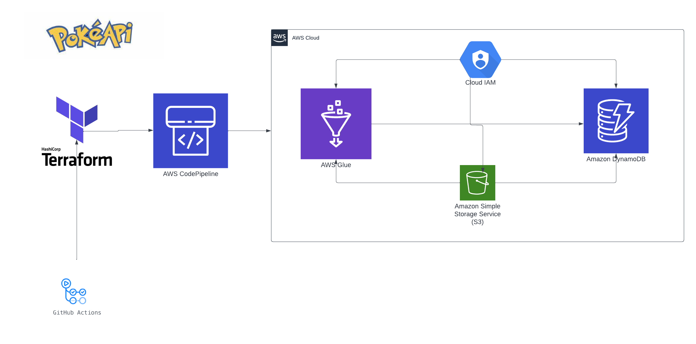

<h1 align="center">

<h3> 
 ETL WITH GLUE JOBS 
 </h3>
<h3> 
 ================= 
 </h3>

>> <h3> Solution Architecture </h3>

>> <h3> Dictionary </h3>

<table>
   <thead>
     <Tr>
       <Hh> Table </h>
       <HH> Field </h>
       <Hh> Type </h>
       <Hh> Description </h>
     </Tr>
   </Thead>
   <tbody>
     <Tr>
       <td> Pokemon </td>
       <td> Pokemon </td>
       <td> string </td>
       <td> Pokemon name </td>
     </Tr>
     <Tr>
       <td> Pokemon </td>
       <td> Generation </td>
       <td> Integer </td>
       <td> Generation number in which Pokemon was introduced </td>
     </Tr>
     <Tr>
       <td> Pokemon </td>
       <td> level </td>
       <td> Integer </td>
       <td> Pokemon level </td>
     </Tr>
     <Tr>
       <td> Pokemon </td>
       <td> pokedex </td>
       <td> Integer </td>
       <td> number in Pokedex of Pokemon </td>
     </Tr>
     <Tr>
       <td> Pokemon </td>
       <td> Attack </td>
       <td> Integer </td>
       <td> Pokemon attack value </td>
     </Tr>
     <Tr>
       <td> Pokemon </td>
       <td> Defense </td>
       <td> Integer </td>
       <td> Pokemon's defense value </td>
     </Tr>
     <Tr>
       <td> Pokemon </td>
       <td> Moves </td>
       <td> array </td>
       <td> List of movements that Pokemon can use </td>
     </Tr>
     <Tr>
       <td> Pokemon </td>
       <td> Type </td>
       <td> array </td>
       <td> Pokemon Type (s) </td>
     </Tr>
     <Tr>
       <td> Contests </td>
       <td> Berry </td>
       <td> string </td>
       <td> Berry name used in contest </td>
     </Tr>
     <Tr>
       <td> Contests </td>
       <td> name </td>
       <td> string </td>
       <td> Contest Name </td>
     </Tr>
     <Tr>
       <td> Contests </td>
       <td> Language </td>
       <td> string </td>
       <td> Contest language </td>
     </Tr>
     <Tr>
       <td> evolutions </td>
       <td> Specie </td>
       <td> string </td>
       <td> Pokemon species </td>
     </Tr>
     <Tr>
       <td> evolutions </td>
       <td> evolves_to </td>
       <td> string </td>
       <td> Pokemon to which the species evolves </td>
     </Tr>
     <Tr>
       <td> evolutions </td>
       <td> chain </td>
       <td> array </td>
       <td> Pokemon list that are part of the evolutionary chain </td>
     </Tr>
     <Tr>
       <td> items </td>
       <td> Attributes </td>
       <td> string </td>
       <td> item attributes </td>
     </Tr>

>> <h3> Description </h3>

 The project consists of a solution to extraction, transformation and data load (ETL) from Pokémon information using AWS services. The process is started through the AWS codepipeline, which is fired by Github when there are updates in the project repository. Then an ETL JOB is created using AWS Glue, which extraction data from a CSV file, transforms this data using a Python script and finally carries this data into a Dynamodb table. In addition, an API REST was developed using AWS API Gateway and AWS Lambda, which allows you to perform CRUD operations on the Dynamodb table.

>> <h3> How to Run </h3>

To run this project you need to follow a few steps:

<ol>
  <li>Make sure you have the TerraForm installed on your machine, if you do not have it, you can install following the instructions on the official website: <a href="https://www.terraform.io/downloads.html">https://www.terraform.io/downloads.html</a></li>
  <li>Clone the project repository on your machine.</li>
  <li>Access the cloned project directory and go to the Infra folder.</li>
  <li>Open the variables.tf file and fill in all requested variables.</li>
  <li>Run the EarthForm Init command to initialize the earth and download the required plugins.</li>
  <li>Run the TerraForm Apply command to create the infrastructure on your AWS account.</li>
  <li>Wait for the infrastructure creation process to be completed.</li>
</ol>

After following these steps, the infrastructure will be ready and its ETL may be executed.

